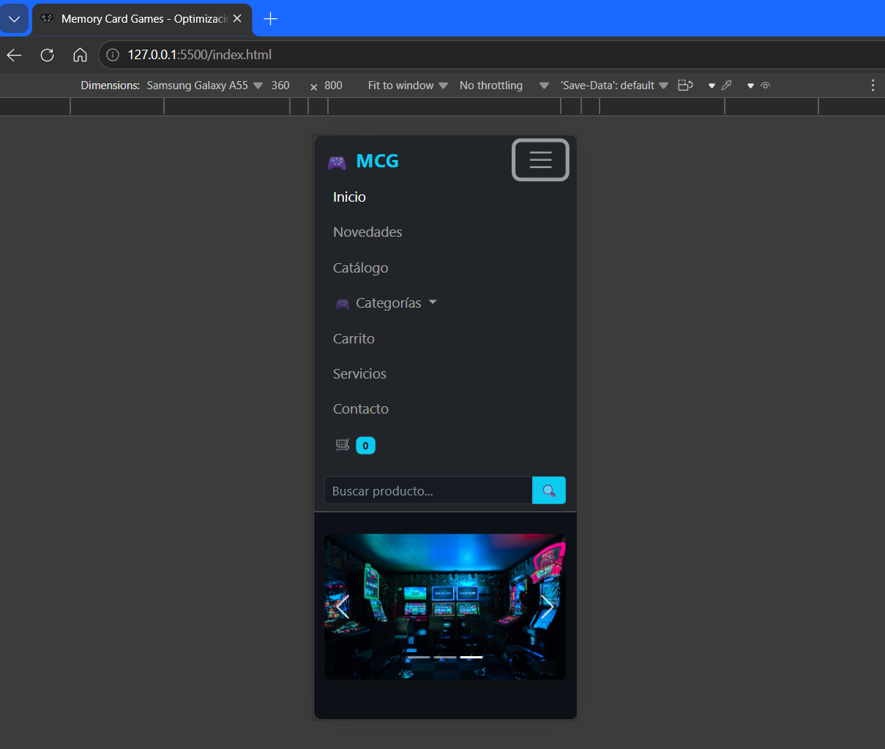
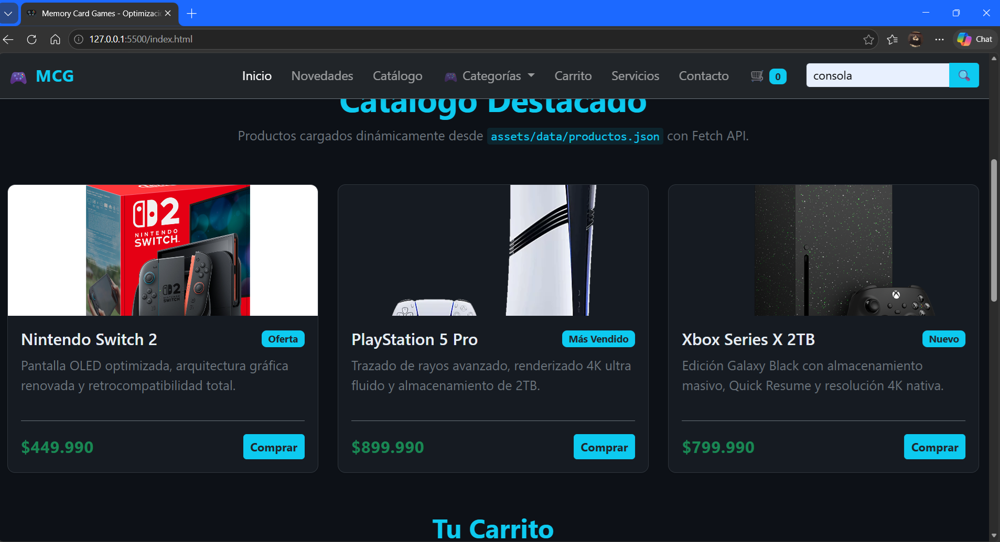
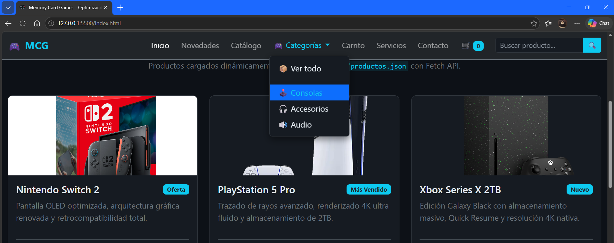
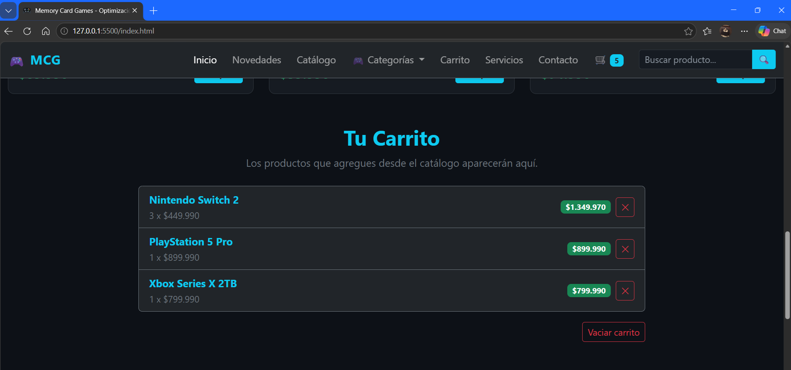
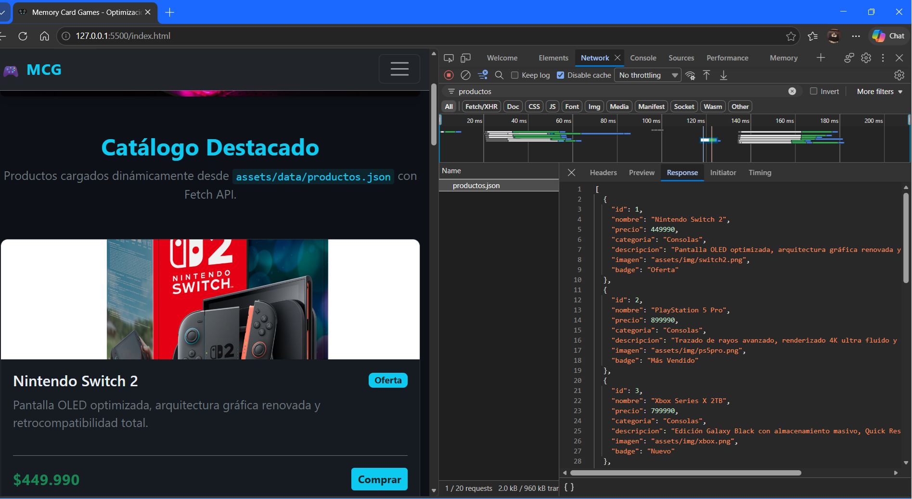
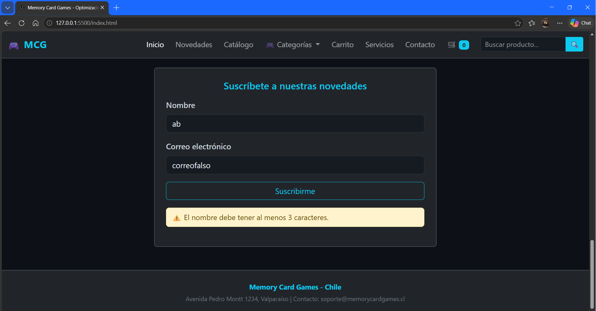
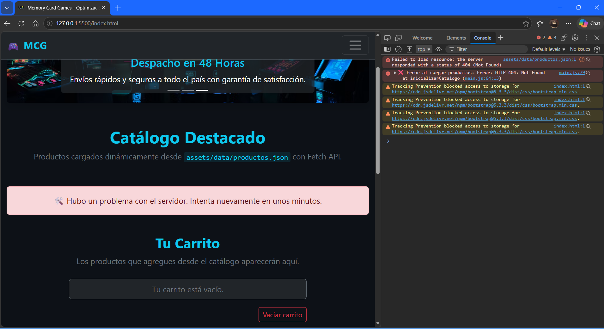

# 🎮 Memory Card Games — Optimización Semana 6

Proyecto desarrollado para la **Actividad Sumativa de la Semana 6** de la asignatura **Desarrollo Frontend I (PFY2201)** de Duoc UC.

El objetivo de esta actividad es **optimizar la lógica y el rendimiento** de una página web de eCommerce mediante la combinación de **Bootstrap 5** y **JavaScript moderno**, aplicando buenas prácticas de manipulación del DOM, manejo de eventos, uso de la Fetch API y organización modular del código.

---

## 👤 Autor

- **Nombre:** Cristián [Apellido]
- **Asignatura:** Desarrollo Frontend I (PFY2201)
- **Docente:** Enrique Urra
- **Fecha de entrega:21 Septiembre 2026

---

## 🔗 Enlaces del proyecto

| Recurso | URL |
|---|---|
| 📦 Repositorio GitHub | (https://github.com/Colivaressandia/DesarrolloFrontend1/tree/main/Semana_6/Cristian_Olivares_PFY2201_Optimizaci%C3%B3n_Semana6)
| 🌐 Despliegue público (gh-pages) |(https://colivaressandia.github.io/DesarrolloFrontend1/Semana_6/Cristian_Olivares_PFY2201_Optimización_Semana6/)

---

## 🚀 Tecnologías utilizadas

- **HTML5** semántico
- **CSS3** con variables y media queries
- **Bootstrap 5.3** (via CDN) para maquetación responsiva
- **JavaScript ES2022** (async/await, template literals, spread operator)
- **Fetch API** para carga dinámica de datos
- **Git + GitHub** para control de versiones
- **GitHub Pages** (rama `gh-pages`) para el despliegue

---

## 📁 Estructura del proyecto

```
nombre_Alumno_PFY2201_Optimización_Semana6/
│
├── index.html                        # Página principal
├── README.md                         # Este archivo
│
├── assets/
│   ├── css/
│   │   └── styles.css                # Estilos personalizados
│   │
│   ├── js/
│   │   └── main.js                   # Lógica JavaScript modular
│   │
│   ├── data/
│   │   └── productos.json            # Datos locales del catálogo
│   │
│   └── img/
│       ├── banner1.jpg
│       ├── banner2.jpg
│       ├── banner3.jpg
│       ├── switch2.png
│       ├── ps5pro.png
│       ├── xbox.png
│       ├── teclado.png
│       ├── mouse.png
│       └── audifonos.png
│
└── capturas/
    ├── 01-estructura-inicial.png
    ├── 02-vista-movil.png
    ├── 03-busqueda.png
    ├── 04-filtro-categoria.png
    ├── 05-carrito-interactivo.png
    ├── 06-fetch-api.png
    ├── 07-formulario-validacion.png
    └── 08-manejo-error.png
```

---

## ✨ Funcionalidades implementadas

### 1. Carga dinámica de productos con Fetch API
Los productos se cargan desde un archivo **JSON local** (`assets/data/productos.json`) mediante `fetch()` con `async/await`. El código verifica `response.ok`, captura excepciones con `try/catch` y muestra mensajes diferenciados según el tipo de error (red vs. HTTP).

### 2. Renderizado dinámico del DOM
Todas las tarjetas de productos y los ítems del carrito se construyen **programáticamente** mediante `document.createElement()` y `appendChild()`, usando `DocumentFragment` para mejorar el rendimiento. No se utiliza `innerHTML` con HTML crudo en las secciones críticas.

### 3. Evento `click` — Agregar al carrito
Cada botón "Comprar" de las tarjetas dispara un evento `click` que agrega el producto al carrito. Si el producto ya existe, **incrementa su cantidad** en lugar de duplicar entradas (mejora sugerida en la retroalimentación de la Semana 5).

### 4. Evento `submit` — Búsqueda de productos
El formulario de búsqueda del navbar captura el evento `submit`, aplica `preventDefault()` y filtra los productos por nombre o categoría sin recargar la página.

### 5. Filtros por categoría
Los enlaces del navbar (`🕹️ Consolas`, `🎧 Accesorios`, `🔊 Audio`, `📦 Ver todo`) filtran el catálogo usando atributos `data-categoria` y reutilizan la función `renderizarProductos()`. Incluyen desplazamiento suave (`scrollIntoView`) y feedback visual del enlace activo.

### 6. Eventos `mouseover` / `mouseout` — Hover dinámico
Las tarjetas reciben eventos de hover por JavaScript (no solo por CSS), aplicando la clase `card-hover` para reforzar la interactividad visual.

### 7. Gestión completa del carrito
- Agregar productos con acumulación de cantidades.
- Eliminar productos individualmente con el botón ✕.
- Vaciar el carrito completo.
- Contador reactivo en el navbar con animación `pulse`.

### 8. Validación del formulario de contacto
El formulario de suscripción valida el nombre (mínimo 3 caracteres) y el formato del correo mediante expresión regular, mostrando mensajes dinámicos de advertencia o éxito.

### 9. Manejo de errores en Fetch
Si el JSON no carga (404, error de red, etc.), se muestra un mensaje amigable al usuario **diferenciando** entre fallos de red y errores HTTP.

---

## 🧩 Organización del código JavaScript

El archivo `main.js` está dividido en **9 secciones comentadas**:

| Sección | Responsabilidad |
|---|---|
| 1. Estado global | Variables `productosGlobal` y `carrito` |
| 2. Referencias al DOM | Cacheo de elementos del DOM |
| 3. Inicializadores | Punto de entrada único con `DOMContentLoaded` |
| 4. Catálogo + Fetch | Carga, parseo y renderizado de productos |
| 5. Búsqueda y filtros | Eventos `submit` y filtros por categoría |
| 6. Carrito | Agregar, eliminar, vaciar y actualizar |
| 7. Efectos interactivos | `mouseover` y `mouseout` delegados |
| 8. Formulario | Validación y mensajes dinámicos |
| 9. Utilidades | Helpers reutilizables |

Cada función incluye su **comentario JSDoc** con descripción, parámetros y tipo de retorno.

---

## 📸 Capturas de pantalla

Las capturas están guardadas en la carpeta `capturas/` y documentan cada funcionalidad solicitada:

### 01 — Estructura inicial de la página
Vista completa del catálogo cargado dinámicamente desde el JSON local.


### 02 — Vista móvil responsiva
Maquetación adaptada a dispositivos móviles mediante el sistema Grid de Bootstrap 5.


### 03 — Búsqueda de productos
Evento `submit` filtrando por término "consola".


### 04 — Filtro por categoría
Click en el enlace "🎧 Accesorios" del navbar, con scroll suave y enlace activo resaltado.


### 05 — Carrito interactivo
Productos agregados al carrito mostrando cantidades acumuladas, subtotales y botón de eliminación.


### 06 — Fetch API funcionando
Pestaña **Network** de DevTools mostrando la petición a `productos.json` con status 200/304.


### 07 — Validación del formulario
Mensaje dinámico de error cuando el correo no tiene un formato válido.


### 08 — Manejo de error en Fetch
Mensaje amigable mostrado cuando el JSON no se encuentra (simulado renombrando el archivo).


---

## 🧪 Pruebas de compatibilidad

El proyecto fue verificado en los siguientes navegadores, sin errores en consola:

| Navegador | Versión | Estado |
|---|---|---|
| 🟢 Google Chrome | 153+ | ✅ Funcional |
| 🔵 Microsoft Edge | 153+ | ✅ Funcional |
| 🟠 Mozilla Firefox | Última | ✅ Funcional |

En todos los casos se comprobó:
- Carga correcta del catálogo vía Fetch API.
- Búsqueda y filtros por categoría.
- Interacción completa con el carrito.
- Validación del formulario de contacto.
- Comportamiento responsivo.

---

## ⚙️ Cómo ejecutar el proyecto localmente

### Requisitos
- Un navegador moderno (Chrome, Edge o Firefox).
- Un servidor local para servir los archivos (⚠️ **no abrir `index.html` directamente con doble click**, ya que `fetch()` falla sobre `file://`).

### Opción A — VS Code + Live Server
1. Abre la carpeta del proyecto en VS Code.
2. Instala la extensión **Live Server** (Ritwick Dey).
3. Click derecho sobre `index.html` → **Open with Live Server**.

### Opción B — Python
```bash
# Dentro de la carpeta del proyecto
python -m http.server 5500
```
Luego abre: `http://localhost:5500`

### Opción C — Node.js
```bash
npx serve
```

---

## 📋 Cumplimiento de la pauta Semana 6

| Requisito | Estado |
|---|---|
| Página principal con productos (imagen, nombre, precio) | ✅ |
| Navbar con al menos 2 categorías simuladas | ✅ (3 categorías + filtro "Ver todo") |
| Footer con información de contacto | ✅ |
| Maquetación responsiva con Bootstrap 5 | ✅ |
| Evento `click` para agregar productos al carrito | ✅ |
| Evento `submit` para procesar búsqueda | ✅ |
| Manipulación dinámica del DOM | ✅ (`createElement`, `appendChild`, `DocumentFragment`) |
| Fetch API para cargar JSON local | ✅ |
| Gestión de errores con mensaje amigable | ✅ |
| Código dividido en funciones reutilizables | ✅ (5 inicializadores + helpers) |
| Comentarios explicativos | ✅ (JSDoc en cada función) |

---

## 🎯 Mejoras aplicadas respecto a la Semana 5

Basado en la retroalimentación del docente:

- ✅ **Cantidad acumulada en el carrito**: en lugar de duplicar entradas del mismo producto, se incrementa la propiedad `cantidad`.
- ✅ **Eliminación individual de productos** desde el carrito con el botón ✕.
- ✅ **Diferenciación de errores** en Fetch (red vs. HTTP) mediante mensajes específicos.
- ✅ **Abstracción de la creación de tarjetas** en la función `crearCardProducto()` para reutilización.
- ✅ **Uso de `DocumentFragment`** para mejorar el rendimiento al insertar múltiples nodos.
- ✅ **Delegación de eventos** para `mouseover` y `mouseout`.
- ✅ **Nomenclatura consistente** de funciones `inicializar*()` sincronizada con la documentación.

---

## 📄 Licencia

Proyecto desarrollado con fines académicos para la asignatura **Desarrollo Frontend I (PFY2201)** de Duoc UC. Todos los recursos gráficos utilizados son de uso libre o de elaboración propia.

---

## 📝 Comentarios finales

Esta entrega representa la evolución del proyecto **Memory Card Games** desde una landing formativa hacia una aplicación web completamente funcional, con énfasis en:

- **Modularidad** y separación de responsabilidades.
- **Rendimiento** mediante `DocumentFragment` y delegación de eventos.
- **Experiencia de usuario** con feedback visual, animaciones y mensajes contextuales.
- **Accesibilidad** con atributos `aria-label` en todos los elementos interactivos.

---

**© 2026 Cristian Olivares Sandia — Duoc UC**
